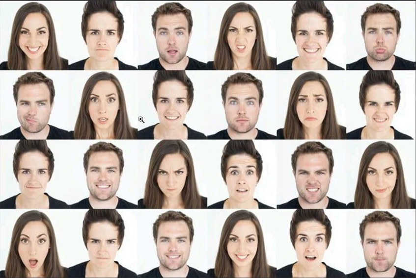

# 😄 Facial Emotion Detection

> A Deep Learning project that detects human facial emotions in real-time using CNNs and OpenCV.

---

## 🧩 Dataset
📚 **FER-2013 Dataset**  
[Download from Kaggle](https://www.kaggle.com/datasets/msambare/fer2013)

---

## 🧠 Model Training
Run the training notebook:
```bash
jupyter notebook Model_training.ipynb
```
After training, a model file (`face_model_100epochs.h5`) will be generated automatically.

---

## ⚙️ Installation

Make sure you have Python 3.8+ installed, then install the dependencies:

```bash
pip install tensorflow keras numpy pandas opencv-python
```

---

## 🚀 Run the Project

### ▶️ Real-time Detection
```bash
python test.py
```

### 🖼️ Image Detection
```bash
python testdata.py
```

---

## 🧰 Tech Stack
- 🧠 **TensorFlow / Keras** – Model building and training  
- 👁️ **OpenCV** – Face detection and video frame processing  
- 📊 **NumPy, Pandas** – Data preprocessing  
- 🪶 **Python** – Backend scripting

---

## 😎 Features
✅ Real-time facial emotion detection using webcam  
✅ Works on static image inputs  
✅ Trained on FER-2013 dataset  
✅ Detects seven different emotions  
✅ Compact and efficient CNN model  

---

## 📸 Demo

| Sample Image | Prediction |
|---------------|-------------|
|  |  |

---

## 🧑‍💻 Author
**J. Dishanth**  
💼 [GitHub](https://github.com/dishanthj) | 🔗 [LinkedIn]([https://linkedin.com/in/YOURPROFILE](https://www.linkedin.com/in/dishanth-j-a951042a6))


